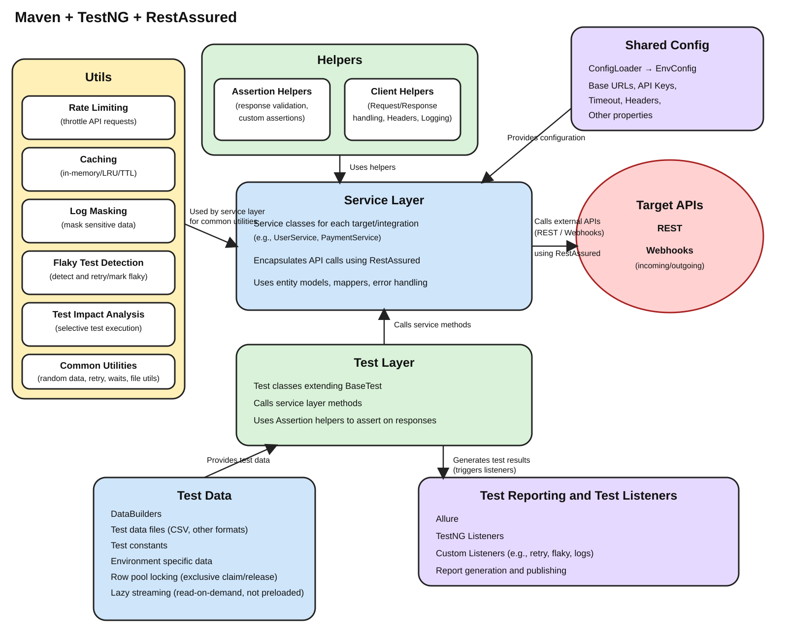

# Reqres API Automation Framework

A layered TestNG + RestAssured API test automation framework covering **REST** and **Webhook** protocols
behind one protocol-agnostic client abstraction. Tests describe behaviour; the framework owns
configuration, request building, masked logging, and reporting.

<p align="center">
  
</p>

An architecture reference (basic + detailed diagrams, component reference, request-lifecycle walkthrough)
is available for onboarding — ask in Claude Code to regenerate/open it, or see `docs/` for prior
requirements/plans/reviews produced by the agent pipeline described below.

## Tech stack

| Concern | Library |
|---|---|
| Language / build | Java 17, Maven |
| Test execution | TestNG 7.9 |
| HTTP / REST | RestAssured 5.4 (+ json-schema-validator) |
| Webhook stub | WireMock (JRE8) 2.35 |
| Reporting | Allure 2.27 (allure-testng, allure-rest-assured) |
| JSON | Jackson Databind |
| Logging | SLF4J + Logback |

## Project structure

```
src/main/java/com/reqres/automation/
  config/       ConfigLoader, EnvConfig            — layered env resolution
  clients/      ApiClient, ClientFactory,           — factory/strategy dispatch
                RequestSpecFactory, RestAssuredConfigFactory
    rest/       RestClientBase, UserRestClient, RestStubServer
    webhook/    WebhookReceiver                     — embeds WireMock; exposes
                stubIncomingCallResponse(...) so test classes never drive WireMock's
                stubbing DSL directly
  models/       rest entity/request/response POJOs
  assertions/   ResponseAssertions (incl. assertBodyValueAbsent), SchemaAssertions,
                WebhookAssertions (incl. assertCallReceivedWithDifferentPayload,
                assertCallReceivedExactly) — every protocol's test code (REST, webhook)
                calls into these rather than writing inline response parsing, field
                navigation, or direct TestNG Assert/WireMock-verify calls
  util/         Constants, LogMasker

src/test/java/com/reqres/automation/
  base/         Base*Test — thread-local client per test class (parallel-safe)
  testdata/     UserDataBuilder — synthetic test-payload factory
  dataproviders/  UserApiNegativeDataProvider, UserApiDataProvider, UnknownResourceDataProvider,
                AuthenticationApiDataProvider, WebhookReceiptNegativeDataProvider,
                dataproviders/csv/CsvLazyDataProvider — dedicated location for
                @DataProvider test data, kept separate from the test classes they feed;
                CSV-backed providers read lazily from src/test/resources/testdata/*.csv
  rest/ webhook/  — test classes

src/test/resources/
  config/       common.properties + qa/staging/prod.properties
  schemas/      JSON schemas used by SchemaAssertions
  suites/       testng.xml — TestNG suite definition (moved from repo root)
  testdata/     CSV files backing the lazy CSV DataProviders

infra/          docker-compose.yml — local SonarQube, Grafana, Elasticsearch, Jenkins
.github/workflows/api-tests.yml    — CI: PR → smoke, schedule/dispatch → regression
```

### Test-writing convention

`src/main` is reserved for reusable framework/engine code: configuration,
clients, services, assertion helpers, models, and shared utilities. `src/test`
contains the executable tests and all test-specific support code, including
base test classes, fixtures, data providers, test-data builders, suite files,
schemas, and environment data. Code in `src/main` must not depend on code or
resources in `src/test`.

Every test class, across both protocol areas (REST, webhook), only
orchestrates a call into `clients/` and a check into `assertions/`, plus TestNG
annotations/data providers. A test class never constructs a raw request/connection, never
drives a mock's stubbing/verification DSL, never parses a raw response, and never asserts
directly — if a helper doesn't yet exist for something a test needs, the gap gets filled in
`clients/`/`assertions/`, not inlined into the test.

## Prerequisites

- JDK 17
- Maven (or use the bundled `./mvnw` / `./mvnw.cmd` wrapper)

## Running tests

```bash
./mvnw test                    # runs the full suite (src/test/resources/suites/testng.xml)
./mvnw test -Dgroups=smoke     # smoke-tagged tests only
./mvnw test -Dgroups=regression
```

Tests run in parallel — `src/test/resources/suites/testng.xml` uses `parallel="classes" thread-count="4"`.

### Environments

```bash
./mvnw test -Denv=qa        # default
./mvnw test -Denv=staging
./mvnw test -Denv=prod
```

Config resolves in layers (later overrides earlier): `common.properties` →
`<env>.properties` → gitignored `<env>.local.properties` → identically-named environment variable
(e.g. `rest.base.url` → `REST_BASE_URL`, `api.key` → `API_KEY`). Never commit a real API key — supply it
via `API_KEY` or a local `.local.properties` override.

## Allure reporting

Raw results are written to `target/allure-results` (see `allure.properties`). Requires the
[Allure Commandline](https://allurereport.org/docs/install/) (`brew install allure` on macOS).

```bash
# Serve an interactive report straight from raw results (opens in browser, no report dir left behind)
allure serve target/allure-results

# Generate a report and open it separately
./mvnw allure:report
allure open target/site/allure-maven-plugin

# Generate a single-file HTML report (easy to share/attach — one .html, no server needed)
allure generate --single-file target/allure-results
```

## CI

`.github/workflows/api-tests.yml`:
- **Pull requests** → `smoke` group
- **Nightly schedule (02:00 UTC) / manual `workflow_dispatch`** → `regression` group

Each run uploads Surefire results and the generated Allure report as workflow artifacts.

## Local support infrastructure (optional)

`infra/docker-compose.yml` runs SonarQube (+ Postgres), Grafana, Elasticsearch, and Jenkins for local
code-quality scans and dashboards. Not required to run tests.

```bash
docker compose -f infra/docker-compose.yml up -d
```

## Automation code changes

Automation code changes (new/changed test coverage) in this repo go through the multi-agent pipeline
defined in `.claude/agents/` and documented in `CLAUDE.md`:
`task-analysis-agent` → `planning-agent` → `coding-agent` → `code-review-agent` → `code-quality-agent`.
